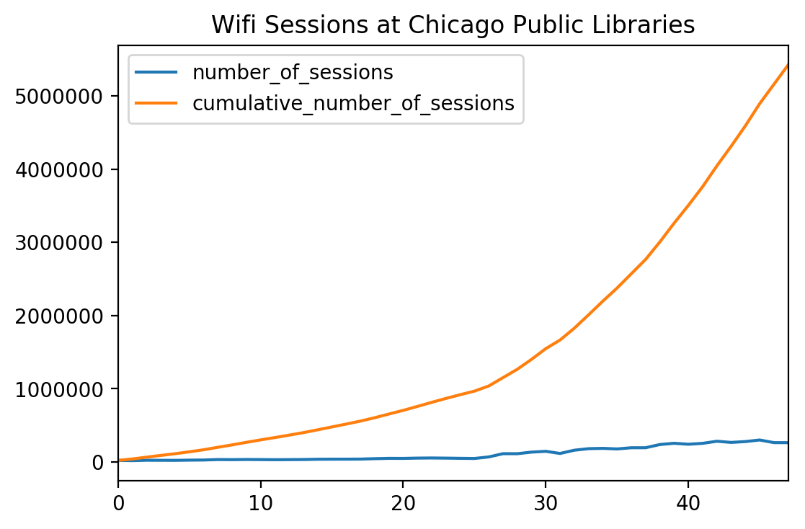

# Appendix B - `pandas`

Unfamiliar with data analysis in Python? Here's a crash course in `pandas`,
[the preeminent Python library for data munging](http://pandas.pydata.org/).

This appendix was written in Pweave markdown. You can view the source [over in
`examples/`](examples/analyses/pandas.mdw), and the command for compiling to
markdown [in the Makefile](Makefile).

## Setup

```python
import pweave

# Allow long lines in code chunks
pweave.rcParams["chunk"]["defaultoptions"].update({
    'wrap': False,
})

import pandas as pd  # pd is canonical shorthand for pandas
from tabulate import tabulate

from sqlalchemy import create_engine

# Connect to our example database (built in the Makefile)
DB_OPTS = dict(
    user='postgres',
    host='localhost',
    pw='',
    port=5432,
    name='libraries'
)

DB_FMT = 'postgresql://{user}:{pw}@{host}:{port}/{name}'
DB_CONN = DB_FMT.format(**DB_OPTS)

engine = create_engine(DB_CONN)
conn = engine.connect()
```


## DataFrames

`pandas` provides really useful convenienience functions for reading data
into their fundamental data type, the [`DataFrame`](http://pandas.pydata.org/pandas-docs/stable/generated/pandas.DataFrame.html).

For CSV files, use [`pandas.read_csv`](http://pandas.pydata.org/pandas-docs/stable/generated/pandas.read_csv.html).


```python
csv = pd.read_csv('examples/data/cpl-wifi.csv')
```


If you've got a database, [`pandas.read_sql`](http://pandas.pydata.org/pandas-docs/stable/generated/pandas.read_sql.html)
accepts a table name or SQL query and a database connection, and returns the
table data or query result as a DataFrame.


```python
table = pd.read_sql('wifi', conn)
```


Sneak a peek at your data with `head`...


```python
def show(df, **kwargs):
    '''tabulate is a Python library that prints tabular data, like DataFrames,
    in the format of your choosing. This function will print to Markdown
    tables; but you can also choose LaTeX or HTML, depending on your output!
    '''
    print(tabulate(df, headers=df, tablefmt='pipe', **kwargs))

show(csv.head())
```


|    |   cumulative_number_of_sessions | month    |   number_of_sessions |   year |
|---:|--------------------------------:|:---------|---------------------:|-------:|
|  0 |                           22263 | January  |                22263 |   2011 |
|  1 |                           41920 | February |                19657 |   2011 |
|  2 |                           66426 | March    |                24506 |   2011 |
|  3 |                           90424 | April    |                23998 |   2011 |
|  4 |                          113666 | May      |                23242 |   2011 |


...and/or `tail`.


```python
show(table.tail())
```


|    |   cumulative_number_of_sessions | month     |   number_of_sessions |   year |
|---:|--------------------------------:|:----------|---------------------:|-------:|
| 43 |                         4311589 | August    |               267902 |   2014 |
| 44 |                         4591246 | September |               279657 |   2014 |
| 45 |                         4892338 | October   |               301092 |   2014 |
| 46 |                         5157545 | November  |               265207 |   2014 |
| 47 |                         5422163 | December  |               264618 |   2014 |


Inherited a file or database with horrid column names? Rename them by setting
`DataFrame.columns` equal to a list of new labels for each column...


```python
# Given a DataFrame with columns ['This is a horrible col', 'Here is more BAD DATA!!!', 'FOIA AWAY']
df.columns = ['good_column', 'better_column', 'best_column']
```


...or change a few particularly egregious columns with [`DataFrame.rename`](http://pandas.pydata.org/pandas-docs/stable/generated/pandas.DataFrame.rename.html#pandas.DataFrame.rename).


```python
df.rename({'The WORST COLUnnfdm OF ever time': 'sensible_column'}, inplace=True)
```


## Selecting data

Select a column or columns with a column name...


```python
table['cumulative_number_of_sessions'].head()
```

```
0     22263
1     41920
2     66426
3     90424
4    113666
Name: cumulative_number_of_sessions, dtype: int64
```


...or array of column names.


```python
show(table[['month', 'year', 'number_of_sessions']].head())
```


|    | month    |   year |   number_of_sessions |
|---:|:---------|-------:|---------------------:|
|  0 | January  |   2011 |                22263 |
|  1 | February |   2011 |                19657 |
|  2 | March    |   2011 |                24506 |
|  3 | April    |   2011 |                23998 |
|  4 | May      |   2011 |                23242 |


You can use `DataFrame.loc` to select rows meeting a given condition...


```python
show(table.loc[table['number_of_sessions'] > 200000].head())
```


|    |   cumulative_number_of_sessions | month   |   number_of_sessions |   year |
|---:|--------------------------------:|:--------|---------------------:|-------:|
| 38 |                         3005168 | March   |               239094 |   2014 |
| 39 |                         3261318 | April   |               256150 |   2014 |
| 40 |                         3504247 | May     |               242929 |   2014 |
| 41 |                         3759587 | June    |               255340 |   2014 |
| 42 |                         4043687 | July    |               284100 |   2014 |


...or you can give your DataFrame a custom index...


```python
# Note that indices need not be unique nor numeric!
indexed_table = table.set_index('month')
show(indexed_table.head(3))
```


|          |   cumulative_number_of_sessions |   number_of_sessions |   year |
|:---------|--------------------------------:|---------------------:|-------:|
| January  |                           22263 |                22263 |   2011 |
| February |                           41920 |                19657 |   2011 |
| March    |                           66426 |                24506 |   2011 |


...then use `DataFrame.loc` to select rows with the given index value...


```python
show(indexed_table.loc['January'])
```


|         |   cumulative_number_of_sessions |   number_of_sessions |   year |
|:--------|--------------------------------:|---------------------:|-------:|
| January |                 22263           |                22263 |   2011 |
| January |                367319           |                33089 |   2012 |
| January |                919469           |                50927 |   2013 |
| January |                     2.57064e+06 |               195108 |   2014 |


...or to select attributes with the given index value and a column name.


```python
indexed_table.loc['February', 'cumulative_number_of_sessions']
```

```
month
February      41920
February     401747
February     968453
February    2766074
Name: cumulative_number_of_sessions, dtype: int64
```


For positional indexing, there's `DataFrame.iloc`. Pass in a single integer
or a slice to get the corresponding rows...


```python
show(table.iloc[:5])
```


|    |   cumulative_number_of_sessions | month    |   number_of_sessions |   year |
|---:|--------------------------------:|:---------|---------------------:|-------:|
|  0 |                           22263 | January  |                22263 |   2011 |
|  1 |                           41920 | February |                19657 |   2011 |
|  2 |                           66426 | March    |                24506 |   2011 |
|  3 |                           90424 | April    |                23998 |   2011 |
|  4 |                          113666 | May      |                23242 |   2011 |


...and key notation to select attributes.


```python
table.iloc[:5]['number_of_sessions']
```

```
0    22263
1    19657
2    24506
3    23998
4    23242
Name: number_of_sessions, dtype: int64
```


## Summary statistics


```python
table['number_of_sessions'].describe()
```

```
count        48.000000
mean     112961.729167
std       94804.167455
min       19657.000000
25%       34304.500000
50%       53743.500000
75%      189012.750000
max      301092.000000
Name: number_of_sessions, dtype: float64
```


```python
table['year'].value_counts()
```

```
2014    12
2013    12
2012    12
2011    12
Name: year, dtype: int64
```


## Transformations

Calculated columns are useful and easy! Operate on multiple columns...


```python
working_table = table.copy()
working_table['pct_total_to_date'] = working_table['number_of_sessions'] / working_table['cumulative_number_of_sessions']
show(working_table.head())
```


|    |   cumulative_number_of_sessions | month    |   number_of_sessions |   year |   pct_total_to_date |
|---:|--------------------------------:|:---------|---------------------:|-------:|--------------------:|
|  0 |                           22263 | January  |                22263 |   2011 |            1        |
|  1 |                           41920 | February |                19657 |   2011 |            0.468917 |
|  2 |                           66426 | March    |                24506 |   2011 |            0.368922 |
|  3 |                           90424 | April    |                23998 |   2011 |            0.265394 |
|  4 |                          113666 | May      |                23242 |   2011 |            0.204476 |


...`apply` lambda functions...


```python
average = working_table['number_of_sessions'].mean()
working_table['above_average'] = working_table['number_of_sessions'].apply(lambda x: x > average)
show(working_table.iloc[25:30])
```


|    |   cumulative_number_of_sessions | month    |   number_of_sessions |   year |   pct_total_to_date | above_average   |
|---:|--------------------------------:|:---------|---------------------:|-------:|--------------------:|:----------------|
| 25 |                          968453 | February |                48984 |   2013 |           0.0505796 | False           |
| 26 |                         1038212 | March    |                69759 |   2013 |           0.0671915 | False           |
| 27 |                         1152321 | April    |               114109 |   2013 |           0.0990254 | True            |
| 28 |                         1266074 | May      |               113753 |   2013 |           0.089847  | True            |
| 29 |                         1401720 | June     |               135646 |   2013 |           0.0967711 | True            |


...or `map` dictionaries for simple calculated or categorical fields.


```python
seasons = {
    'January': 'Winter',
    'February': 'Winter',
    'March': 'Spring',
    'April': 'Spring',
    'May': 'Spring',
    'June': 'Summer',
    'July': 'Summer',
    'August': 'Summer',
    'September': 'Fall',
    'October': 'Fall',
    'November': 'Fall',
    'December': 'Winter'
}

working_table['season'] = working_table['month'].map(seasons)

show(working_table.head(12))
```


|    |   cumulative_number_of_sessions | month     |   number_of_sessions |   year |   pct_total_to_date | above_average   | season   |
|---:|--------------------------------:|:----------|---------------------:|-------:|--------------------:|:----------------|:---------|
|  0 |                           22263 | January   |                22263 |   2011 |           1         | False           | Winter   |
|  1 |                           41920 | February  |                19657 |   2011 |           0.468917  | False           | Winter   |
|  2 |                           66426 | March     |                24506 |   2011 |           0.368922  | False           | Spring   |
|  3 |                           90424 | April     |                23998 |   2011 |           0.265394  | False           | Spring   |
|  4 |                          113666 | May       |                23242 |   2011 |           0.204476  | False           | Spring   |
|  5 |                          139710 | June      |                26044 |   2011 |           0.186415  | False           | Summer   |
|  6 |                          167445 | July      |                27735 |   2011 |           0.165636  | False           | Summer   |
|  7 |                          201379 | August    |                33934 |   2011 |           0.168508  | False           | Summer   |
|  8 |                          234093 | September |                32714 |   2011 |           0.139748  | False           | Fall     |
|  9 |                          268853 | October   |                34760 |   2011 |           0.12929   | False           | Fall     |
| 10 |                          302388 | November  |                33535 |   2011 |           0.110901  | False           | Fall     |
| 11 |                          334230 | December  |                31842 |   2011 |           0.0952697 | False           | Winter   |


Have something a bit more involved? Iterate over your `DataFrame` with `iterrows`.
Note that each iterated row is a tuple containing an index value and the row attributes,
accessible via key notation.


```python
previous_year = None
pct_change = []

for idx, row in working_table.iterrows():
    current_year = row['number_of_sessions']
    if previous_year:
        pct_change.append((current_year - previous_year) / previous_year)
    else:
        pct_change.append(None)
    previous_year = current_year

working_table['pct_change'] = pct_change
```


## Aggregate functions

http://wesmckinney.com/blog/groupby-fu-improvements-in-grouping-and-aggregating-data-in-pandas/

## Plotting


```python
ax = working_table.plot(
    title='Wifi Sessions at Chicago Public Libraries',
    y=['number_of_sessions', 'cumulative_number_of_sessions']
)
```

\

